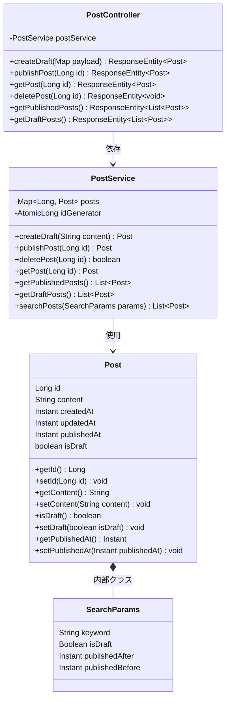
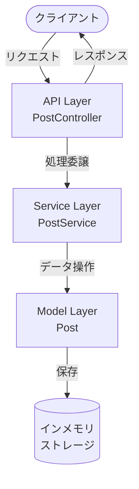
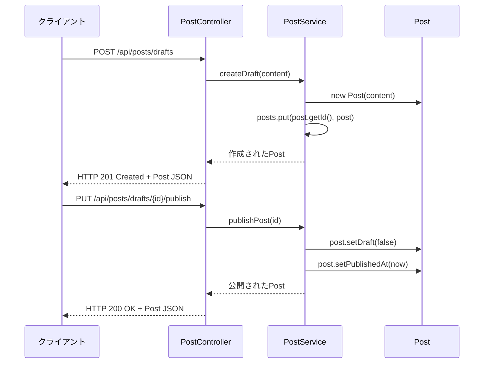

## 仕様

### クラス図


### API構造図


### リクエストフロー図


## 実行方法

### 必要な環境

- JDK 21以上
- 【任意】 Gradle 8.4以上 ※Gradle Wrapperでもかまいません。サンプルコマンドでも使用しています。

### 実行方法

1. ハンズオンディレクトリに移動します。
    ```bash
    cd /workspaces/github-demo-2506/demo/
    ```

2. 必要な依存関係をインストールします。
    ```bash
    ./gradlew build
    ```

3. アプリケーションを起動します。
    ```bash
    ./gradlew bootRun
    ```

4. アプリケーションが起動したら、以下のURLでAPIを利用できます。

---

## API実行のサンプルcurlコマンド

### 1. 下書き投稿の作成
```bash
curl -X POST http://localhost:8080/api/posts/drafts \
-H "Content-Type: application/json" \
-d '{"content": "This is a draft post."}'
```

### 2. 下書き投稿の公開
```bash
curl -X PUT http://localhost:8080/api/posts/drafts/{id}/publish
```

### 3. 投稿の取得
```bash
curl -X GET http://localhost:8080/api/posts/{id}
```

### 4. 投稿の削除
```bash
curl -X DELETE http://localhost:8080/api/posts/{id}
```

### 5. 公開済み投稿の一覧取得
```bash
curl -X GET http://localhost:8080/api/posts/published
```

### 6. 下書き投稿の一覧取得
```bash
curl -X GET http://localhost:8080/api/posts/drafts
```

